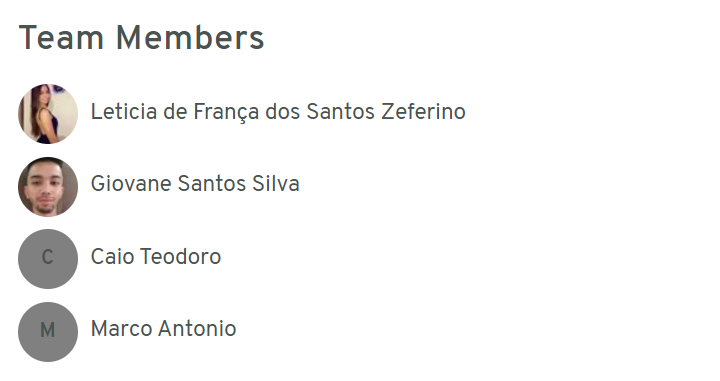
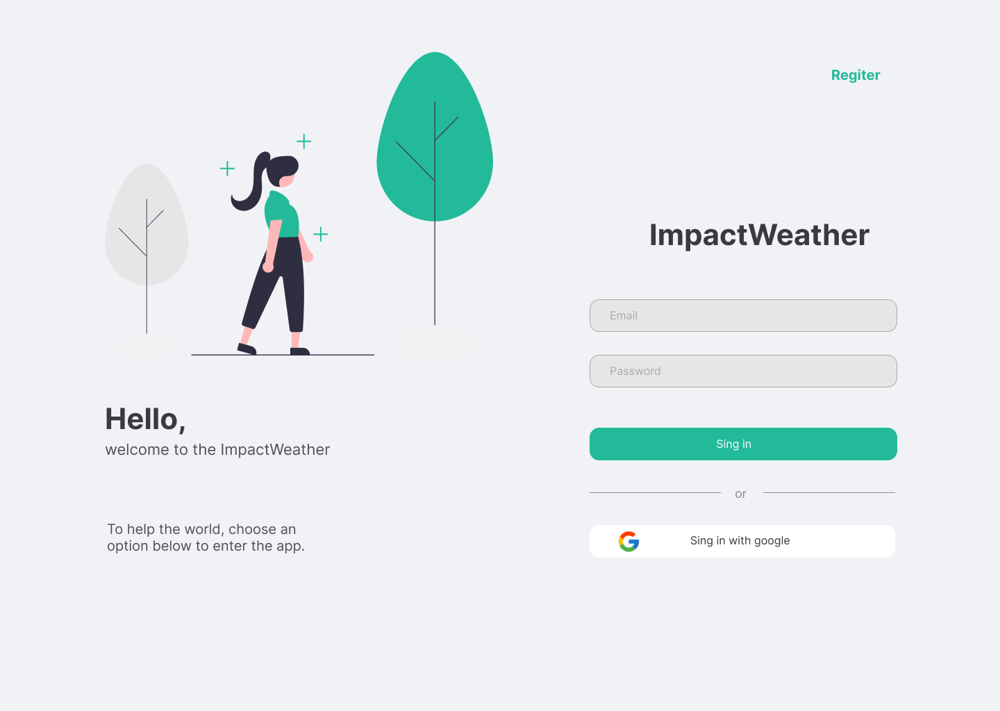
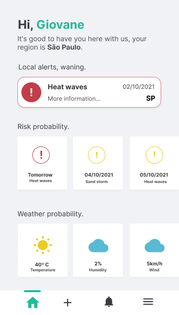
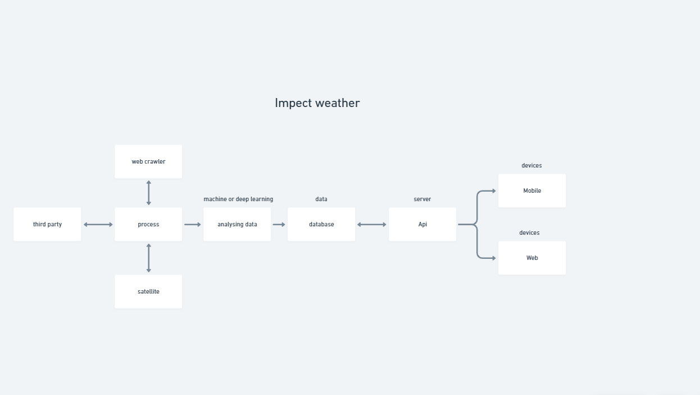

___
## Equipe: OnlyDucks

### Abraçamos a causa:
### AVISO: AS COISAS ESTÃO ESQUENTANDO!

___
### Files

- Prototipo figma: https://www.figma.com/file/ZjT0drpTKgWf2hTG5Xx3yU/Space-Apps
- Resumo documento: https://github.com/onlyDucksH/hackathon-nasa/blob/main/files/ImpactWather_PDF.pdf
- Video global: link
- Video local: https://www.youtube.com/watch?v=0Lzqx9WGqkQ

### Tobicos abordados
- Níveis de duração de intensidade de estresse de calor
- Estimar potenciais impactos humanos e ambientais
- Gerar um nível de alerta de risco de estresse por calor (vermelho, amarelo, verde)
- Para uma área selecionada (por exemplo, cidade, condado, país)
- Risco potencial para um ou mais dos seguintes: incêndios florestais , poluição do ar, danos às colheitas, escassez de abastecimento de água e energia.

## Probleme e Solução

Os impactos das mudanças climáticas e desastres naturais são evidentes globalmente. As ondas de calor são frequentemente associadas a secas e incêndios florestais com impactos de bilhões de dólares nas sociedades, se tornando cada vez mais preocupante. As ondas de calores, tempestades, falta de chuva e secas está aumentando em frequência, com intensidade e duração, devido à poluição, desmatamento e o aquecimento global, impactando estruturas sociais e econômicas.
Com isso, a problemática abordada é a falta de informações concisas e simples, ou, que não estão prontamente acessíveis na forma de avisos/eventos personalizados, gráficos, previsões e estatísticas, que podem ajudar os indivíduos e condados/cidades a tomarem medidas de prevenção/mitigação e garantir a segurança durante o acontecimento de desastres naturais, com foco nas mudanças climáticas e os extremos relacionados ao calor/ar que afetam a saúde humana e os sistemas ambientais e ecológicos.
A partir dessa problemática, a ideação do projeto é o desenvolvimento de uma ferramenta mobile e web global que desfrute de Observações da Terra (EO), com a análise analítica de dados de satélite e sensores para gerar métricas, com dados de crowdsourcing (informações e/ou opiniões imputadas pelos usuários para a comunidade aberta do aplicativo), onde, cada pessoa, em sua determinada região, compartilha sobre o clima, com fotos, e informações interativas de radares e mapas de satélites, com avisos sobre os impactos potenciais dos eventos, com orientações sobre medidas de mitigação de uma maneira fácil e prática.
O software disponibilizará em seu dashboard informações atualizadas em tempo real sobre os  níveis de duração de intensidade de estresse de calor, estimativas  sobre os potenciais e impactos humanos/ambientais, além de gerar alerta de risco e emergência dos eventos, como:
Incêndios florestais, tempestades,  enchentes, poluição/qualidade do ar, danos às colheitas, escassez de abastecimento de água e energia, entre outros;
Conforme a localização selecionada pelo usuário, viáveis para os usuários que residem em regiões perigosas e com alta estimativa ambiental de catástrofes ambientais, para assim, gerar segurança, bem-estar e conscientização sobre o aquecimento global.

## Web

### Tecnologia: React.js

A plataforma web é direcionada para organizacoes responsaveis pelo clima e suas respectivas regiões, onde poderão realizar o seu cadastro como instituicoes e gerar alertas com os niveis de risco, relatar um problema climatico, solicitar que as pessoas da regiao fiquem em casa, e até realizar uma evacuação se nescessario, contendo também uma dashboard informativa onde poderam ver o que está acontecendo em sua região de cadastro, permitindo tambem receber registro de acontecimentos
relatados pelos proprios usuario e apartir disso disparar para demais pessoas para que nao corram o risco de possiveis acidentes.

### Funcionalidades:

- Cadastro de usuarios para visualizar informações.
- Cadastro de orgãos responsveis para emição de alertas customizados.
- Dashboard analítca para visualizar desmatamento, queimadas, seca etc...

## Mobile

### Tecnologia: React-Native

A plataforma mobile e direcionada pasa os usuarios finais a fim de trazer facilidade e praticidade na hora de receber uma alerta ou vizualizar os dados, possibilitando registro de eventos occoridos nas cidades e regiões para evitar problemas e desastres.

### Funcionalidades 

- Cadastro de usuarios.
- Registrar região.
- Gerenciar dados.
- Visualização sobre o clima, temperatura, humidade, velocidade do vento.
- Visualização sobre eventos de risco com ondas de calor, tsunami, tempestades de poeira.
- Receber alertas customizados proporcionando segurança.
- Iformações para concientizações:
  - Poluições.
  - Plante árvores.
  - Aquecimento global.
  
## Back-end

### Tecnologias: Node.js, Python, Mysql, Mongo

O back-end sera composto por uma API onde provera todos os dados para ambas plataformas, a coleta de dados sera feita com micro-serviços extraindo informações de dominios publico, observações da terra ultilizando satelites e sensores para prover as informacoes, e por crowdsourced data relatados pelos usuarios e organizações.

### Funcionalidades

- Coleta de informações crowdsourced.
- Integrações com APIs externas publicas.
- Coleta web crawler de informações de dominios publicos.
- Coleta de informações de observações da terra, satelites, sensores.

## Referencias

Nasa:

https://droughtmonitor.unl.edu/

https://data.giss.nasa.gov/gistemp/

Outros

http://www.dgi.inpe.br/

https://www.cptec.inpe.br/

https://nadm-noaa.hub.arcgis.com/

http://terrabrasilis.dpi.inpe.br/

https://droughtmonitor.unl.edu/

https://gmao.gsfc.nasa.gov/GMAO_products/NRT_products.php

http://www2.dgi.inpe.br/catalogo/explore

https://queimadas.dgi.inpe.br/queimadas/bdqueimadas

https://www.sophia-mar.pt/uploads/GUIA_2_Observacao_da_Terra_temperatura_e_cor_do_oceano.pdf